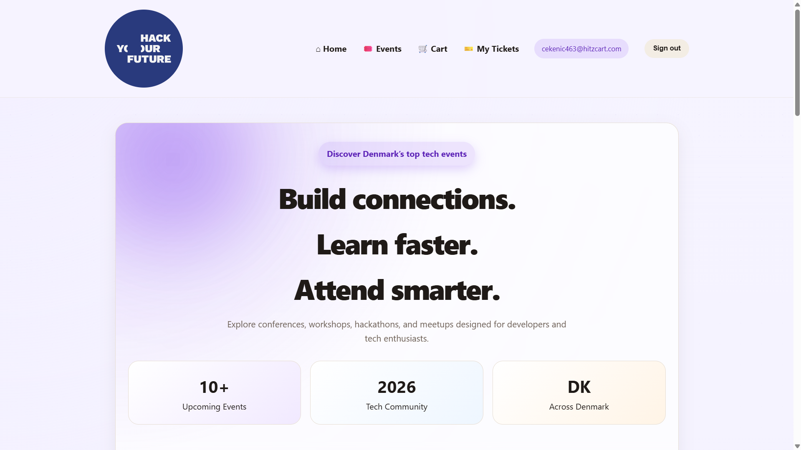
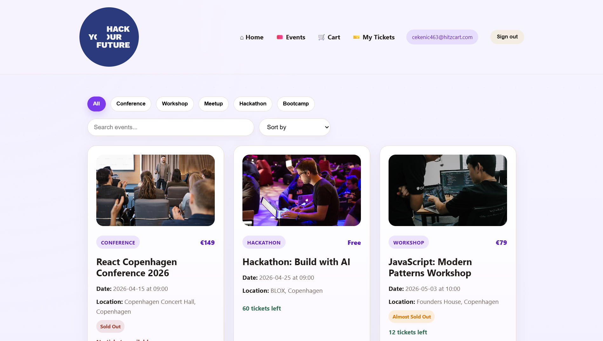
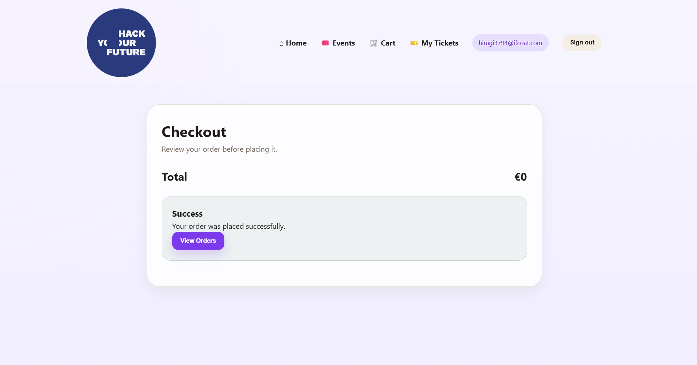
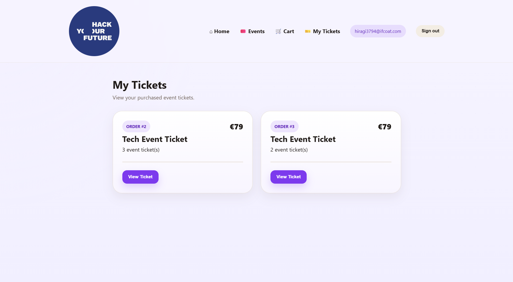

# 🎟️ Event Ticketing Platform

A modern event ticketing platform built with **Next.js**, where users can browse events, manage a shopping cart, authenticate, purchase tickets, and view their orders.

## 🌐 Live Demo

Frontend: https://event-ticketing-platform-ruddy.vercel.app/

API: https://event-ticketing-platform-em4s.onrender.com/api/events

---

## 📖 Overview

This project allows users to:

- Browse upcoming tech events
- Search and filter events
- Sort events by price
- View detailed event information
- Add tickets to a shopping cart
- Register and log in
- Complete a checkout process
- View purchased tickets and order history

The project was originally developed using React and Vite, then migrated to Next.js using the App Router architecture as part of a modernization and deployment exercise.

## ✨ Features

### Event Discovery

- Event listing page
- Search functionality
- Category filtering
- Price sorting
- Pagination
- Event details modal

### Shopping Cart

- Add tickets to cart
- Update quantities
- Remove items
- Automatic total calculation
- Persistent cart using localStorage

### Authentication

- User registration
- User login
- Session persistence
- Protected routes

### Orders

- Checkout flow
- Order creation
- Order history
- Individual order details

## 📸 Screenshots

### Home Page



### Events Page



### Checkout



### Order Detail



---

## 🏗️ Project Architecture

```txt
event-ticketing-platform
│
├── app/
├── components/
├── context/
├── utils/
├── assets/
├── api/
│   ├── db.json
│   └── server.cjs
│
├── package.json
├── next.config.mjs
└── README.md
```
